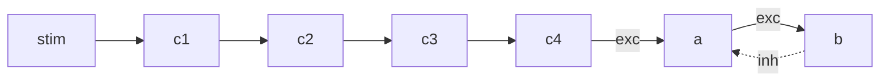

# snn_mc — Spiking Neural Network Model Checker

Clean rebuild of the DSL -> Intermediate Representation -> NuSMV -> Python pipeline.
Lives under `NewStructure/` so it does not interfere with the legacy root code.

## What this project does

```
.dsl  (user)  ->  Parser  ->  NetworkIR  ->  Composer  ->  SMV emitter
                                                                |
                                              model.smv + properties.smv + combined.smv
                                                                |
                                                         NuSMV subprocess
                                                                |
                                                Result analysis  ->  Python sim stub
```

Same six-stage flow as the legacy repo, but each module has a single responsibility,
N (number of neurons) is parameterized, and the runner emits a numbered set of
demo artifacts (`step1_*` ... `step6_*`) that the professor can step through.

## Layout

| Path | Purpose |
| --- | --- |
| `snn_mc/cli.py` | Entry point. `python -m snn_mc run <file.dsl>` |
| `snn_mc/ir.py` | NetworkIR / Edge / ArchetypeInstance / Composition / ParamSpec |
| `snn_mc/dsl/parser.py` | Line-based DSL parser -> NetworkIR |
| `snn_mc/archetypes/` | 7 archetype kinds, each supports `neurons=` OR `N=/prefix=` |
| `snn_mc/composer.py` | Semantic validation (LEAD/FOLLOWER, role check, name existence) |
| `snn_mc/smv/` | NuSMV emission: LIF module + main model + properties + combined |
| `snn_mc/verify/` | NuSMV subprocess + log parser |
| `snn_mc/sim/` | Post-verify Python stub |
| `snn_mc/report/` | 6-step demo artifacts (diagram, IR, composition, properties, results) |
| `examples/` | Demo DSL files (`series_negloop.dsl` is the main one) |
| `reference/` | Hand-written `lif_neuron_6.smv` and 6 golden archetype SMV files |
| `docs/` | `luong_chay_du_an.md` / `project_flow.md` (code flow, VN/EN), `pipeline.md`, `parameterize_N.md`, `huong_dan_su_dung.md` |
| `tests/` | Smoke test running the demo example with `--skip-verify` |

## Quickstart

```bash
# 1. NuSMV must be on PATH (see top-level TONG_QUAN_DU_AN.md).
# 2. Run the demo pipeline:
python -m snn_mc run examples/series_negloop.dsl --out runs/demo

# Output:
#   runs/demo/step1_diagram.md
#   runs/demo/step2_input.dsl
#   runs/demo/step3_ir.json
#   runs/demo/step4_composition.txt
#   runs/demo/step5_properties.smv
#   runs/demo/step6_results.txt
#   runs/demo/{model,properties,combined}.smv
#   runs/demo/nusmv.log
#   runs/demo/sim_stub.txt
```

## Parameterizing N

Two equivalent ways to declare a 4-neuron chain:

```text
# Explicit list (legacy style):
block simple_series input=stim neurons=c1,c2,c3,c4 params=default

# Parameterized N (new):
block simple_series input=stim N=4 prefix=c params=default
```

CLI override applies the same N to every block that uses `N=`:

```bash
python -m snn_mc run examples/series_negloop.dsl --override N=10
```

See `docs/parameterize_N.md` for details.

## Demo example: Simple Series + Negative Loop



DSL the user writes:

```text
include neuron_base.dsl
input stim
schedule stim values TRUE TRUE FALSE TRUE TRUE FALSE

block simple_series  input=stim N=4 prefix=c params=default
block negative_loop  input=c4  A=a B=b           params=default
```

Run it with `python -m snn_mc run examples/series_negloop.dsl --out runs/demo`
and present `step1..step6` files to the professor.
