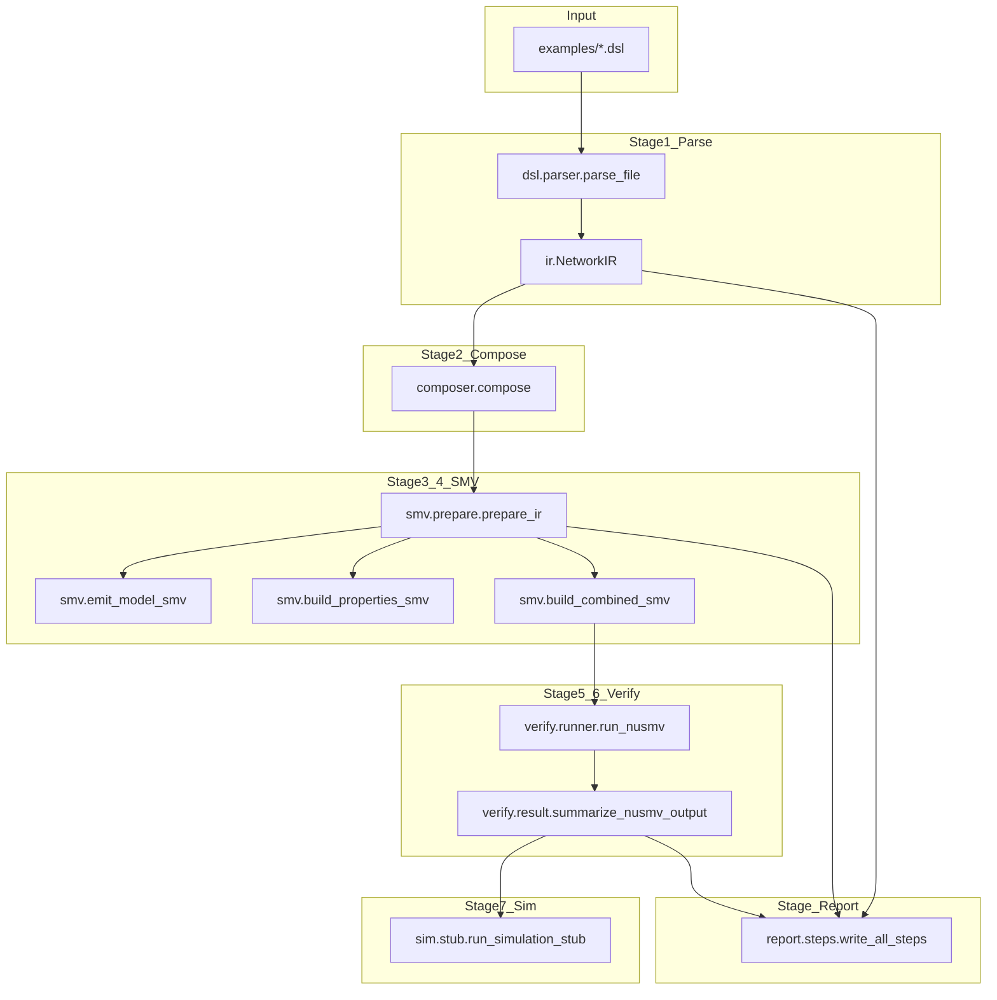
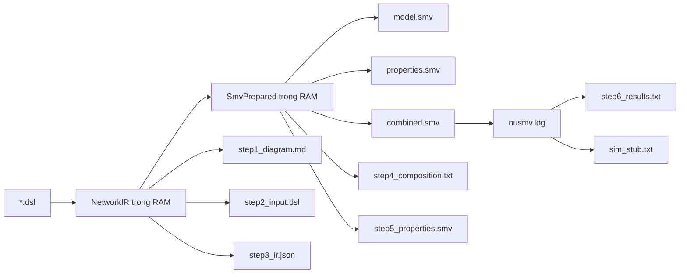
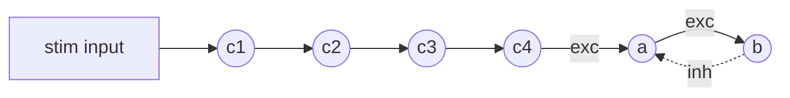

# Luồng chạy dự án `snn_mc` (NewStructure)

Tài liệu này dành cho **người mới**: mô tả luồng xử lý từ file `.dsl` đầu vào đến các file output, **đi qua module/hàm Python nào**, và **6 file step** tương ứng với từng giai đoạn demo.

> **Không nhầm với code cũ:** thư mục `NewStructure/` là pipeline mới (`snn_mc`). Code ở root repo (`main.py`, `dsl_generate_nusmv.py`, `smv_generator.py`, …) vẫn tồn tại làm tham chiếu; khi làm việc với dự án mới, chỉ cần quan tâm `NewStructure/`.

---

## 1. Điểm vào (entry point)

Lệnh người dùng chạy:

```bash
python -m snn_mc run examples/series_negloop.dsl --out runs/demo
```

Luồng khởi động Python:

| Bước | File | Hàm |
|------|------|-----|
| 1 | `snn_mc/__main__.py` | gọi `cli.main()` |
| 2 | `snn_mc/cli.py` | `main()` — điều phối toàn bộ pipeline |

Toàn bộ logic nghiệp vụ nằm trong `cli.main()` (khoảng dòng 106–216). Các module khác **không** tự chạy khi import; chỉ được gọi từ CLI (hoặc test).

---

## 2. Sơ đồ tổng thể

### 2.1. Luồng xử lý (code — khớp `cli.main()`)



**Ghi chú thứ tự thực tế trong `cli.main()`:**

1. Parse + compose → `NetworkIR`
2. `prepare_ir` → `SmvPrepared`
3. Ghi `model.smv`, `properties.smv`, `combined.smv`
4. (Tùy chọn) `run_nusmv` → parse log
5. **`write_all_steps`** — luôn chạy, sinh `step1`…`step6`
6. (Nếu verify OK) `run_simulation_stub` → `sim_stub.txt`

### 2.2. Luồng artefact (file trên đĩa)



Thư mục output: tham số `--out` (mặc định `runs/demo/`).

---

## 3. Bảng tóm tắt: giai đoạn → file → hàm

| # | Giai đoạn | File Python | Hàm chính | Input | Output |
|---|-----------|-------------|-----------|-------|--------|
| 0 | CLI | `snn_mc/cli.py` | `main()` | `argv`, đường dẫn `.dsl` | tạo `out_dir`, exit code |
| 1 | Parse DSL | `snn_mc/dsl/parser.py` | `parse_file` → `parse_text` → `_parse_body` | nội dung DSL | `NetworkIR` |
| 1b | Include | `snn_mc/dsl/parser.py` | `expand_includes` | dòng `include path` | text DSL đã gộp |
| 1c | Block macro | `snn_mc/archetypes/*.py` | `*Archetype.apply_block` | `block kind=...` | thêm `edges`, `archetypes` vào IR |
| 2 | Compose | `snn_mc/composer.py` | `compose` | `NetworkIR` | `NetworkIR` (đã validate) |
| 3 | Chuẩn bị SMV | `snn_mc/smv/prepare.py` | `prepare_ir` | `NetworkIR` | `SmvPrepared` |
| 4a | Model SMV | `snn_mc/smv/model.py`, `lif_module.py` | `emit_model_smv`, `emit_model_core`, `generate_lif_module` | IR + prepared | `model.smv` |
| 4b | Properties | `snn_mc/smv/properties.py` | `build_properties_smv`, `emit_properties_block` | prepared + IR | `properties.smv` |
| 4c | Combined | `snn_mc/smv/combined.py` | `build_combined_smv` | IR + prepared | `combined.smv` |
| 5 | Chạy NuSMV | `snn_mc/verify/runner.py` | `run_nusmv`, `find_nusmv` | `combined.smv` | `nusmv.log` |
| 6 | Đọc log | `snn_mc/verify/result.py` | `summarize_nusmv_output`, `extract_counterexample_block` | text log | `NuSMVSummary`, CE snippet |
| 7 | Báo cáo 6 bước | `snn_mc/report/steps.py` | `write_all_steps` | IR, prepared, dsl_text, summary | `step1`…`step6` |
| 8 | Sim stub | `snn_mc/sim/stub.py` | `run_simulation_stub` | IR + prepared | `sim_stub.txt` |

---

## 4. Cấu trúc thư mục `snn_mc/`

```
NewStructure/
├── snn_mc/
│   ├── __main__.py          # python -m snn_mc
│   ├── cli.py               # điều phối pipeline
│   ├── ir.py                # NetworkIR, Edge, ArchetypeInstance, ...
│   ├── identifiers.py       # sanitize_identifier (tên an toàn cho NuSMV)
│   ├── composer.py          # validate IR sau parse
│   ├── dsl/
│   │   └── parser.py        # đọc .dsl → NetworkIR
│   ├── archetypes/          # 7 loại block + base + graph_index
│   ├── smv/                 # sinh file .smv (KHÔNG chạy NuSMV)
│   ├── verify/              # subprocess NuSMV + parse log
│   ├── sim/                 # stub sau verify
│   └── report/              # sinh step1..step6
├── examples/                # file .dsl mẫu
├── reference/               # SMV viết tay (golden)
├── docs/                    # tài liệu
└── tests/                   # smoke test
```

| Thư mục | Một câu mô tả |
|---------|----------------|
| `dsl/` | Biến text DSL thành cấu trúc `NetworkIR`. |
| `archetypes/` | Mỗi `block simple_series`, `block negative_loop`, … thêm cạnh + metadata archetype. |
| `smv/` | Dịch IR → chuỗi NuSMV (định dạng `.smv`). |
| `verify/` | Gọi binary NuSMV và đếm spec true/false. |
| `sim/` | Ghi file tóm tắt wiring (không mô phỏng LIF đầy đủ). |
| `report/` | Xuất 6 file demo cho giáo sư. |

---

## 5. Chi tiết từng giai đoạn

### 5.1. Parse DSL → `NetworkIR`

**File:** `snn_mc/dsl/parser.py`

| Hàm | Việc làm |
|-----|----------|
| `parse_file(path)` | Đọc file, gọi `parse_text` |
| `expand_includes(text, ...)` | Xử lý `include neuron_base.dsl` (gộp nội dung file con) |
| `parse_text` / `_parse_body` | Đọc từng dòng: `input`, `neuron`, `edge`, `block`, `schedule`, `spec`, … |

**Cấu trúc dữ liệu:** `snn_mc/ir.py`

| Class | Ý nghĩa |
|-------|---------|
| `NetworkIR` | Toàn bộ mạng sau parse |
| `Edge` | Cạnh có hướng `src → dst`, `weight` (+ exc, − inh) |
| `ArchetypeInstance` | Một lần dùng archetype (`kind`, `nodes`, `inputs`) |
| `ParamSpec` | Bộ tham số LIF (`tau`, `w_exc`, `w_inh`, …) |
| `Composition` | Khai báo `compose sequential` / `parallel` |

Khi gặp dòng `block simple_series input=stim N=4 prefix=c ...`:

1. Parser tra `BLOCK_REGISTRY` trong `archetypes/__init__.py`
2. Gọi `SimpleSeriesArchetype.apply_block(kv, ctx)` trong `archetypes/simple_series.py`
3. `expand_chain` (trong `archetypes/base.py`) sinh tên `c1..c4` và thêm các `Edge`

### 5.2. Compose (validate)

**File:** `snn_mc/composer.py` — hàm `compose(ir)`

- Kiểm tra mỗi `input=` trong archetype trỏ tới **input đã khai báo** hoặc **neuron đã tồn tại** (ví dụ `input=c4` sau khi `simple_series` đã tạo `c4`).
- Kiểm tra `roles` (LEAD/FOLLOWER) nếu có.

Không đổi topology; chỉ raise `ValueError` nếu DSL không nhất quán.

### 5.3. Prepare SMV → `SmvPrepared`

**File:** `snn_mc/smv/prepare.py` — hàm `prepare_ir(ir)`

- Đổi tên identifier sang dạng NuSMV-safe (`identifiers.sanitize_identifier`).
- Gom cạnh vào `exc_srcs` / `inh_srcs` per neuron (OR các nguồn kích thích/ức chế).
- Gộp archetype explicit + **graph-detected** (`detect_archetypes`).

Output: dataclass `SmvPrepared` — snapshot dùng chung cho emit model, properties và report.

### 5.4. Sinh file `.smv` (folder `smv/`)

**Vì sao tên folder `smv`?** Đây là tầng **emission** — chỉ **sinh** text định dạng SMV/NuSMV. Tầng **`verify/`** mới **chạy** công cụ NuSMV.

| File | Hàm | Output |
|------|-----|--------|
| `smv/model.py` | `emit_model_core` | `MODULE main`, VAR, ASSIGN, instance neuron |
| `smv/lif_module.py` | `generate_lif_module` | `MODULE lif_default(...)` |
| `smv/properties.py` | `emit_properties_block` | CTLSPEC / LTLSPEC |
| `smv/combined.py` | `build_combined_smv` | ghép model + properties + module LIF |

Thứ tự trong `combined.smv`: **model core → specs → MODULE lif_***.

`cli.main()` ghi ba file:

```text
out_dir/model.smv
out_dir/properties.smv
out_dir/combined.smv    ← file NuSMV chạy thật
```

### 5.5. Verify (NuSMV)

**File:** `snn_mc/verify/runner.py`

- `find_nusmv()` — tìm `NuSMV` / `nusmv` trên PATH
- `run_nusmv(combined_path, log_path)` — `subprocess`, ghi `nusmv.log`

**File:** `snn_mc/verify/result.py`

- `summarize_nusmv_output(log)` → `NuSMVSummary` (đếm `is true` / `is false`)
- `extract_counterexample_block(log)` → đoạn trace nếu có spec sai

Bỏ qua nếu `--skip-verify`.

### 5.6. Report — 6 file step

**File:** `snn_mc/report/steps.py` — `write_all_steps(...)`

| File output | Module | Hàm render | Nguồn dữ liệu |
|-------------|--------|------------|----------------|
| `step1_diagram.md` | `report/diagram.py` | `render_step1` | `NetworkIR.edges` → Mermaid + ASCII |
| `step2_input.dsl` | `report/steps.py` | (copy text) | nội dung DSL gốc |
| `step3_ir.json` | `report/ir_dump.py` | `render_step3` / `ir_to_dict` | `NetworkIR` serialized |
| `step4_composition.txt` | `report/composition.py` | `render_step4` | `prepared.arch_list`, compositions |
| `step5_properties.smv` | `report/properties_view.py` | `render_step5` | gọi lại `build_properties_smv` |
| `step6_results.txt` | `report/results_view.py` | `render_step6` | `NuSMVSummary`, counterexample |

Sau khi ghi file, CLI in từng section `=== Step N: ... ===` ra stdout (`_print_section`).

### 5.7. Sim stub (tùy chọn)

**File:** `snn_mc/sim/stub.py` — `run_simulation_stub`

Chỉ chạy khi: không `--skip-sim`, đã verify, và `false_count == 0`.

Ghi comment tóm tắt wiring `x_exc` / `x_inh` per neuron — **không** replay động học LIF (NuSMV là nguồn chân lý cho LIF).

---

## 6. Map: 6 bước demo ↔ giai đoạn code

| Bước demo (giáo sư) | Giai đoạn code chính | File output |
|---------------------|----------------------|-------------|
| Bước 1 — Sơ đồ mạng | Parse xong (`NetworkIR`) | `step1_diagram.md` |
| Bước 2 — DSL gốc | (input, không transform) | `step2_input.dsl` |
| Bước 3 — IR | Parse + compose | `step3_ir.json` |
| Bước 4 — Composition | `prepare_ir` + archetypes | `step4_composition.txt` |
| Bước 5 — Properties | `build_properties_smv` | `step5_properties.smv` |
| Bước 6 — Kết quả | `run_nusmv` + `summarize_nusmv_output` | `step6_results.txt` |

---

## 7. Ví dụ trace: `examples/series_negloop.dsl`

### 7.1. DSL đầu vào

```text
include neuron_base.dsl
input stim
schedule stim values TRUE TRUE FALSE TRUE TRUE FALSE
block simple_series  input=stim N=4 prefix=c params=default
block negative_loop  input=c4   A=a B=b      params=default
```

### 7.2. Sau parse (`NetworkIR`)

- **Inputs:** `stim`
- **Neurons:** `c1`, `c2`, `c3`, `c4`, `a`, `b`
- **Archetypes (explicit):** 2 instance — `simple_series`, `negative_loop`
- **Edges chính:** `stim→c1→c2→c3→c4→a→b` và inhibitory `b→a`

### 7.3. Composer

- `negative_loop` có `input=c4` → `c4` phải đã có trong `ir.neurons` (do `simple_series` tạo trước). Nếu đổi `N=6` mà vẫn `input=c4` sẽ **lỗi** — phải sửa thành `input=c6`.

### 7.4. Thứ tự gọi trong `cli.main()` (tóm tắt)

```text
dsl_text = đọc file
ir = parse_file(dsl, override_n=...)
ir = composer.compose(ir)
prepared = smv.prepare_ir(ir)
ghi model.smv, properties.smv, combined.smv
run_nusmv(combined.smv) → nusmv.log
summary = summarize_nusmv_output(log)
write_all_steps(...) → step1..step6
run_simulation_stub(...) → sim_stub.txt   # nếu mọi spec pass
```

### 7.5. Topology (N=4)



---

## 8. Các archetype (`block` kinds)

Đăng ký trong `snn_mc/archetypes/__init__.py` → `BLOCK_REGISTRY`:

| `kind` trong DSL | File |
|------------------|------|
| `simple_series` | `archetypes/simple_series.py` |
| `series_multiple_outputs` | `archetypes/series_multiple_outputs.py` |
| `parallel_composition` | `archetypes/parallel_composition.py` |
| `negative_loop` | `archetypes/negative_loop.py` |
| `positive_loop` | `archetypes/positive_loop.py` |
| `contralateral_inhibition` | `archetypes/contralateral_inhibition.py` |
| `inhibition_of_behavior` | `archetypes/inhibition_of_behavior.py` |

Helper chung trong `archetypes/base.py`:

- `expand_chain` — `N=4 prefix=c` → `c1..c4`
- `stim_token` — khi `input=` trỏ neuron (`c4`), spec LTL dùng `c4.spike` thay vì `c4`

Mỗi archetype còn có `specs(inst)` sinh CTLSPEC/LTLSPEC (gọi từ `smv/properties.py`).

---

## 9. Exit code CLI

| Mã | Ý nghĩa |
|----|---------|
| 0 | Thành công (hoặc `--skip-verify`) |
| 1 | Có spec NuSMV **false** |
| 2 | Không tìm thấy file `.dsl` |
| 3 | Không tìm thấy NuSMV |
| 4 | Log không parse được dòng `is true` (thường lỗi cú pháp SMV) |

---

## 10. Đọc thêm

| Tài liệu | Khi nào dùng |
|----------|----------------|
| [huong_dan_su_dung.md](huong_dan_su_dung.md) | Lệnh chạy, flag, cách đọc từng file output |
| [pipeline.md](pipeline.md) | Tổng quan 6 bước (tiếng Anh, góc demo giáo sư) |
| [parameterize_N.md](parameterize_N.md) | `N=/prefix=` và `--override N=` |
| [../reference/](../reference/) | File SMV viết tay để đối chiếu |
| [../README.md](../README.md) | Tổng quan package |
