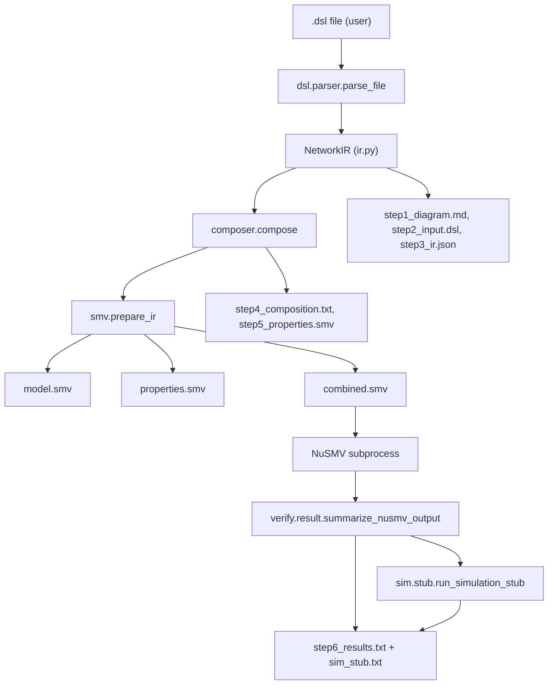
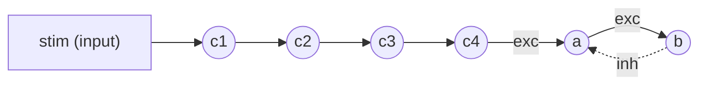

# Pipeline overview (six steps)

This document tracks exactly what every CLI invocation produces for the supervisor.

> For a detailed code walkthrough (which Python files and functions run), see [project_flow.md](project_flow.md) (English) or [luong_chay_du_an.md](luong_chay_du_an.md) (Vietnamese).



## What each step file shows

| File | Purpose |
| --- | --- |
| `step1_diagram.md` | Mermaid + ASCII picture of the network (Bước 1: sơ đồ). |
| `step2_input.dsl` | Exact DSL the user wrote (Bước 2: đoạn mã DSL). |
| `step3_ir.json` | Pretty-printed `NetworkIR` (Bước 3: cấu trúc trung gian). |
| `step4_composition.txt` | Archetype instances + how they connect (Bước 4: composition). |
| `step5_properties.smv` | Auto-generated CTL/LTL specs (Bước 5: thuộc tính). |
| `step6_results.txt` | NuSMV true/false counts + counterexample (Bước 6: kết quả). |

The pipeline also produces three SMV files (`model.smv`, `properties.smv`, `combined.smv`)
plus `nusmv.log` and `sim_stub.txt`. They are the inputs/outputs of the NuSMV stage and
remain useful for thesis appendices.

## Demo command

```bash
python -m snn_mc run examples/series_negloop.dsl --out runs/demo
```

If NuSMV is not yet installed, run the same command with `--skip-verify`. All six step
files are still written; step 6 reports the skip reason.

## Demo example walkthrough

The supervisor asked for a small example composing two archetypes. The DSL in
`examples/series_negloop.dsl` does exactly that:

```text
include neuron_base.dsl
input stim
schedule stim values TRUE TRUE FALSE TRUE TRUE FALSE
block simple_series  input=stim N=4 prefix=c params=default
block negative_loop  input=c4   A=a B=b      params=default
```

Network shape (with N=4):



Step 1 will write this same diagram for the user; step 4 will list two archetype instances
(`simple_series` and `negative_loop`); step 5 will contain the auto-generated CTL/LTL specs
for both.
