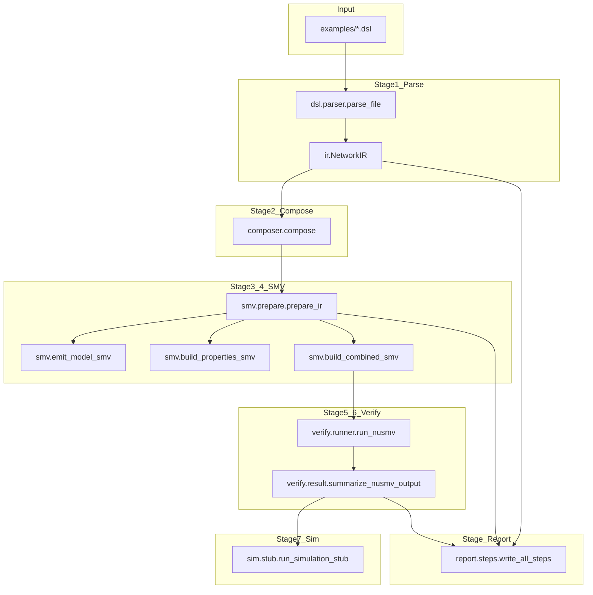
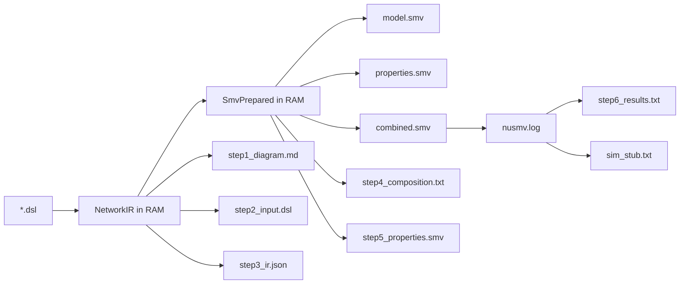
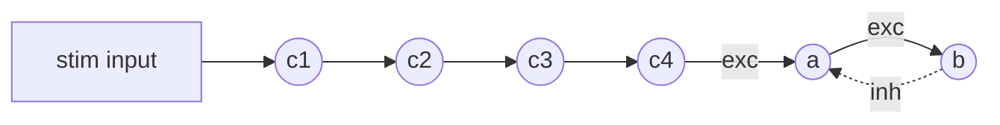

# `snn_mc` project flow (NewStructure)

This document is for **newcomers**: it describes the processing flow from the input `.dsl` file to output artefacts, **which Python modules and functions** are involved, and how the **six numbered step files** map to each demo stage.

> **Do not confuse with legacy code:** `NewStructure/` is the new pipeline (`snn_mc`). Code at the repo root (`main.py`, `dsl_generate_nusmv.py`, `smv_generator.py`, …) remains as reference only; for the new project, focus on `NewStructure/`.

> **Vietnamese version:** [luong_chay_du_an.md](luong_chay_du_an.md)

---

## 1. Entry point

Command the user runs:

```bash
python -m snn_mc run examples/series_negloop.dsl --out runs/demo
```

Python startup path:

| Step | File | Function |
|------|------|----------|
| 1 | `snn_mc/__main__.py` | calls `cli.main()` |
| 2 | `snn_mc/cli.py` | `main()` — orchestrates the full pipeline |

All business logic lives in `cli.main()` (roughly lines 106–216). Other modules **do not** run on import; they are only invoked from the CLI (or tests).

---

## 2. Overall diagrams

### 2.1. Processing flow (code — matches `cli.main()`)



**Actual order inside `cli.main()`:**

1. Parse + compose → `NetworkIR`
2. `prepare_ir` → `SmvPrepared`
3. Write `model.smv`, `properties.smv`, `combined.smv`
4. (Optional) `run_nusmv` → parse log
5. **`write_all_steps`** — always runs, produces `step1`…`step6`
6. (If verify OK) `run_simulation_stub` → `sim_stub.txt`

### 2.2. Artefact flow (files on disk)



Output directory: `--out` argument (default `runs/demo/`).

---

## 3. Summary table: stage → file → function

| # | Stage | Python file | Main function(s) | Input | Output |
|---|-------|-------------|------------------|-------|--------|
| 0 | CLI | `snn_mc/cli.py` | `main()` | `argv`, `.dsl` path | `out_dir`, exit code |
| 1 | Parse DSL | `snn_mc/dsl/parser.py` | `parse_file` → `parse_text` → `_parse_body` | DSL text | `NetworkIR` |
| 1b | Include | `snn_mc/dsl/parser.py` | `expand_includes` | `include path` lines | flattened DSL text |
| 1c | Block macro | `snn_mc/archetypes/*.py` | `*Archetype.apply_block` | `block kind=...` | append `edges`, `archetypes` to IR |
| 2 | Compose | `snn_mc/composer.py` | `compose` | `NetworkIR` | `NetworkIR` (validated) |
| 3 | Prepare SMV | `snn_mc/smv/prepare.py` | `prepare_ir` | `NetworkIR` | `SmvPrepared` |
| 4a | Model SMV | `snn_mc/smv/model.py`, `lif_module.py` | `emit_model_smv`, `emit_model_core`, `generate_lif_module` | IR + prepared | `model.smv` |
| 4b | Properties | `snn_mc/smv/properties.py` | `build_properties_smv`, `emit_properties_block` | prepared + IR | `properties.smv` |
| 4c | Combined | `snn_mc/smv/combined.py` | `build_combined_smv` | IR + prepared | `combined.smv` |
| 5 | Run NuSMV | `snn_mc/verify/runner.py` | `run_nusmv`, `find_nusmv` | `combined.smv` | `nusmv.log` |
| 6 | Parse log | `snn_mc/verify/result.py` | `summarize_nusmv_output`, `extract_counterexample_block` | log text | `NuSMVSummary`, CE snippet |
| 7 | Six-step report | `snn_mc/report/steps.py` | `write_all_steps` | IR, prepared, dsl_text, summary | `step1`…`step6` |
| 8 | Sim stub | `snn_mc/sim/stub.py` | `run_simulation_stub` | IR + prepared | `sim_stub.txt` |

---

## 4. `snn_mc/` directory layout

```
NewStructure/
├── snn_mc/
│   ├── __main__.py          # python -m snn_mc
│   ├── cli.py               # pipeline orchestrator
│   ├── ir.py                # NetworkIR, Edge, ArchetypeInstance, ...
│   ├── identifiers.py       # sanitize_identifier (NuSMV-safe names)
│   ├── composer.py          # validate IR after parse
│   ├── dsl/
│   │   └── parser.py        # read .dsl → NetworkIR
│   ├── archetypes/          # 7 block kinds + base + graph_index
│   ├── smv/                 # emit .smv files (does NOT run NuSMV)
│   ├── verify/              # NuSMV subprocess + log parsing
│   ├── sim/                 # post-verify stub
│   └── report/              # produce step1..step6
├── examples/                # sample .dsl files
├── reference/               # hand-written SMV (golden)
├── docs/                    # documentation
└── tests/                   # smoke tests
```

| Folder | One-line description |
|--------|----------------------|
| `dsl/` | Turn DSL text into a `NetworkIR` structure. |
| `archetypes/` | Each `block simple_series`, `block negative_loop`, … adds edges + archetype metadata. |
| `smv/` | Translate IR → NuSMV source (`.smv` format). |
| `verify/` | Invoke the NuSMV binary and count true/false specs. |
| `sim/` | Write a wiring summary file (not a full LIF replay). |
| `report/` | Export six demo files for presentation. |

---

## 5. Stage-by-stage detail

### 5.1. Parse DSL → `NetworkIR`

**File:** `snn_mc/dsl/parser.py`

| Function | Role |
|----------|------|
| `parse_file(path)` | Read file, call `parse_text` |
| `expand_includes(text, ...)` | Handle `include neuron_base.dsl` (inline child file) |
| `parse_text` / `_parse_body` | Parse each line: `input`, `neuron`, `edge`, `block`, `schedule`, `spec`, … |

**Data structures:** `snn_mc/ir.py`

| Class | Meaning |
|-------|---------|
| `NetworkIR` | Full network after parsing |
| `Edge` | Directed edge `src → dst`, `weight` (+ exc, − inh) |
| `ArchetypeInstance` | One archetype use (`kind`, `nodes`, `inputs`) |
| `ParamSpec` | LIF parameter set (`tau`, `w_exc`, `w_inh`, …) |
| `Composition` | `compose sequential` / `parallel` declaration |

When the parser sees `block simple_series input=stim N=4 prefix=c ...`:

1. Look up `BLOCK_REGISTRY` in `archetypes/__init__.py`
2. Call `SimpleSeriesArchetype.apply_block(kv, ctx)` in `archetypes/simple_series.py`
3. `expand_chain` (in `archetypes/base.py`) generates names `c1..c4` and appends `Edge` objects

### 5.2. Compose (validate)

**File:** `snn_mc/composer.py` — function `compose(ir)`

- Ensures each archetype `input=` refers to a **declared input** or an **existing neuron** (e.g. `input=c4` after `simple_series` created `c4`).
- Validates `roles` (LEAD/FOLLOWER) when present.

Does not change topology; raises `ValueError` if the DSL is inconsistent.

### 5.3. Prepare SMV → `SmvPrepared`

**File:** `snn_mc/smv/prepare.py` — function `prepare_ir(ir)`

- Rename identifiers to NuSMV-safe form (`identifiers.sanitize_identifier`).
- Group edges into `exc_srcs` / `inh_srcs` per neuron (OR of excitatory/inhibitory sources).
- Merge explicit archetypes + **graph-detected** ones (`detect_archetypes`).

Output: `SmvPrepared` dataclass — shared snapshot for model emission, properties, and reporting.

### 5.4. Emit `.smv` files (the `smv/` folder)

**Why is the folder named `smv`?** This is the **emission** layer — it only **generates** SMV/NuSMV text. The **`verify/`** layer **runs** the NuSMV tool.

| File | Function | Output |
|------|----------|--------|
| `smv/model.py` | `emit_model_core` | `MODULE main`, VAR, ASSIGN, neuron instances |
| `smv/lif_module.py` | `generate_lif_module` | `MODULE lif_default(...)` |
| `smv/properties.py` | `emit_properties_block` | CTLSPEC / LTLSPEC |
| `smv/combined.py` | `build_combined_smv` | model + properties + LIF modules |

Order inside `combined.smv`: **model core → specs → MODULE lif_***.

`cli.main()` writes three files:

```text
out_dir/model.smv
out_dir/properties.smv
out_dir/combined.smv    ← file NuSMV actually runs
```

#### `--emit-mode` (CLI flag)

| Value | Neuron encoding in NuSMV |
|-------|--------------------------|
| `lif` (default) | Full LIF submodule `lif_<paramSet>(x_exc, x_inh, t)` with membrane `P`, leak, threshold |
| `simple_boolean` | Discrete threshold `bool_thr(inp_net, thr, t)` — weighted sum of inputs vs `tau` |

### 5.5. Verify (NuSMV)

**File:** `snn_mc/verify/runner.py`

- `find_nusmv()` — locate `NuSMV` / `nusmv` on PATH
- `run_nusmv(combined_path, log_path)` — `subprocess`, writes `nusmv.log`

**File:** `snn_mc/verify/result.py`

- `summarize_nusmv_output(log)` → `NuSMVSummary` (count `is true` / `is false`)
- `extract_counterexample_block(log)` → trace excerpt when a spec fails

Skipped if `--skip-verify`.

### 5.6. Report — six step files

**File:** `snn_mc/report/steps.py` — `write_all_steps(...)`

| Output file | Module | Render function | Data source |
|-------------|--------|-----------------|-------------|
| `step1_diagram.md` | `report/diagram.py` | `render_step1` | `NetworkIR.edges` → Mermaid + ASCII |
| `step2_input.dsl` | `report/steps.py` | (copy text) | original DSL |
| `step3_ir.json` | `report/ir_dump.py` | `render_step3` / `ir_to_dict` | serialized `NetworkIR` |
| `step4_composition.txt` | `report/composition.py` | `render_step4` | `prepared.arch_list`, compositions |
| `step5_properties.smv` | `report/properties_view.py` | `render_step5` | calls `build_properties_smv` again |
| `step6_results.txt` | `report/results_view.py` | `render_step6` | `NuSMVSummary`, counterexample |

After writing files, the CLI prints each `=== Step N: ... ===` section to stdout (`_print_section`).

### 5.7. Sim stub (optional)

**File:** `snn_mc/sim/stub.py` — `run_simulation_stub`

Runs only when: not `--skip-sim`, verification ran, and `false_count == 0`.

Writes a comment summary of `x_exc` / `x_inh` wiring per neuron — **does not** replay LIF dynamics (NuSMV is authoritative for LIF).

---

## 6. Map: six demo steps ↔ code stages

| Demo step | Main code stage | Output file |
|-----------|-----------------|-------------|
| Step 1 — Network diagram | After parse (`NetworkIR`) | `step1_diagram.md` |
| Step 2 — Original DSL | (input, no transform) | `step2_input.dsl` |
| Step 3 — IR | Parse + compose | `step3_ir.json` |
| Step 4 — Composition | `prepare_ir` + archetypes | `step4_composition.txt` |
| Step 5 — Properties | `build_properties_smv` | `step5_properties.smv` |
| Step 6 — Results | `run_nusmv` + `summarize_nusmv_output` | `step6_results.txt` |

---

## 7. Walkthrough: `examples/series_negloop.dsl`

### 7.1. Input DSL

```text
include neuron_base.dsl
input stim
schedule stim values TRUE TRUE FALSE TRUE TRUE FALSE
block simple_series  input=stim N=4 prefix=c params=default
block negative_loop  input=c4   A=a B=b      params=default
```

### 7.2. After parse (`NetworkIR`)

- **Inputs:** `stim`
- **Neurons:** `c1`, `c2`, `c3`, `c4`, `a`, `b`
- **Archetypes (explicit):** 2 instances — `simple_series`, `negative_loop`
- **Main edges:** `stim→c1→c2→c3→c4→a→b` and inhibitory `b→a`

### 7.3. Composer

- `negative_loop` has `input=c4` → `c4` must already be in `ir.neurons` (created by `simple_series`). If you change to `N=6` but keep `input=c4`, it **fails** — use `input=c6` instead.

### 7.4. Call order in `cli.main()` (summary)

```text
dsl_text = read file
ir = parse_file(dsl, override_n=...)
ir = composer.compose(ir)
prepared = smv.prepare_ir(ir)
write model.smv, properties.smv, combined.smv
run_nusmv(combined.smv) → nusmv.log
summary = summarize_nusmv_output(log)
write_all_steps(...) → step1..step6
run_simulation_stub(...) → sim_stub.txt   # if all specs pass
```

### 7.5. Topology (N=4)



---

## 8. Archetypes (`block` kinds)

Registered in `snn_mc/archetypes/__init__.py` → `BLOCK_REGISTRY`:

| DSL `kind` | File |
|------------|------|
| `simple_series` | `archetypes/simple_series.py` |
| `series_multiple_outputs` | `archetypes/series_multiple_outputs.py` |
| `parallel_composition` | `archetypes/parallel_composition.py` |
| `negative_loop` | `archetypes/negative_loop.py` |
| `positive_loop` | `archetypes/positive_loop.py` |
| `contralateral_inhibition` | `archetypes/contralateral_inhibition.py` |
| `inhibition_of_behavior` | `archetypes/inhibition_of_behavior.py` |

Shared helpers in `archetypes/base.py`:

- `expand_chain` — `N=4 prefix=c` → `c1..c4`
- `stim_token` — when `input=` points to a neuron (`c4`), LTL specs use `c4.spike` instead of bare `c4`

Each archetype also implements `specs(inst)` to emit CTLSPEC/LTLSPEC (called from `smv/properties.py`).

---

## 9. CLI exit codes

| Code | Meaning |
|------|---------|
| 0 | Success (or `--skip-verify`) |
| 1 | At least one NuSMV spec is **false** |
| 2 | `.dsl` file not found |
| 3 | NuSMV not found on PATH |
| 4 | Log has no parsable `is true` lines (often SMV syntax error) |

---

## 10. Further reading

| Document | When to use |
|----------|-------------|
| [huong_dan_su_dung.md](huong_dan_su_dung.md) | Run commands, flags, how to read outputs (Vietnamese) |
| [pipeline.md](pipeline.md) | Six-step overview (demo-focused) |
| [parameterize_N.md](parameterize_N.md) | `N=/prefix=` and `--override N=` |
| [../reference/](../reference/) | Hand-written SMV for comparison |
| [../README.md](../README.md) | Package overview |
