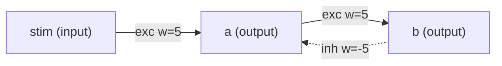

# Step 1 — Network diagram

Source DSL: `examples\negloop_only.dsl`

## Mermaid



## ASCII

```
Network (ASCII summary)
=======================
Inputs (1): ['stim']
Neurons (2): ['a', 'b']

Edges per destination neuron:
  a <- exc: [('stim', 5)]    inh: [('b', -5)]
  b <- exc: [('a', 5)]    inh: []
```
