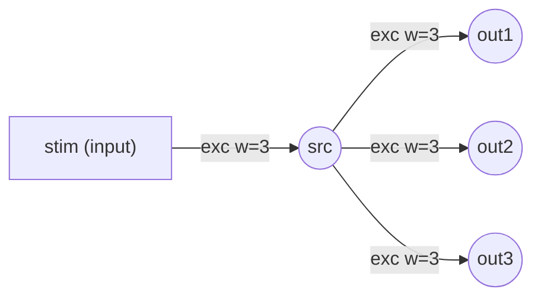

# Step 1 — Network diagram

Source DSL: `NewStructure\examples\parallel_only.dsl`

## Mermaid



## ASCII

```
Network (ASCII summary)
=======================
Inputs (1): ['stim']
Neurons (4): ['out1', 'out2', 'out3', 'src']

Edges per destination neuron:
  out1 <- exc: [('src', 3)]    inh: []
  out2 <- exc: [('src', 3)]    inh: []
  out3 <- exc: [('src', 3)]    inh: []
  src <- exc: [('stim', 3)]    inh: []
```
