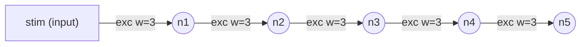

# Step 1 — Network diagram

Source DSL: `NewStructure\examples\series_only.dsl`

## Mermaid



## ASCII

```
Network (ASCII summary)
=======================
Inputs (1): ['stim']
Neurons (5): ['n1', 'n2', 'n3', 'n4', 'n5']

Edges per destination neuron:
  n1 <- exc: [('stim', 3)]    inh: []
  n2 <- exc: [('n1', 3)]    inh: []
  n3 <- exc: [('n2', 3)]    inh: []
  n4 <- exc: [('n3', 3)]    inh: []
  n5 <- exc: [('n4', 3)]    inh: []
```
