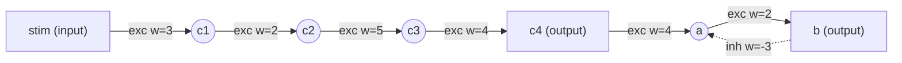

# Step 1 — Network diagram

Source DSL: `examples\series_negloop_weighted.dsl`

## Mermaid



## ASCII

```
Network (ASCII summary)
=======================
Inputs (1): ['stim']
Neurons (6): ['a', 'b', 'c1', 'c2', 'c3', 'c4']

Edges per destination neuron:
  a <- exc: [('c4', 4)]    inh: [('b', -3)]
  b <- exc: [('a', 2)]    inh: []
  c1 <- exc: [('stim', 3)]    inh: []
  c2 <- exc: [('c1', 2)]    inh: []
  c3 <- exc: [('c2', 5)]    inh: []
  c4 <- exc: [('c3', 4)]    inh: []
```
